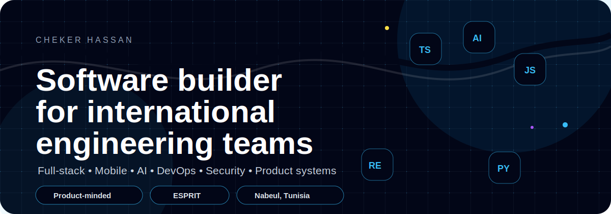
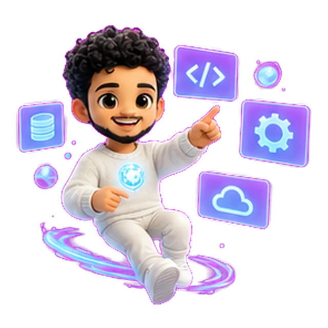

<!-- Portfolio Hero SVG -->

  

---

## 🧑‍🚀 Portfolio Identity

<table>
  <tr>
    <td width="62%" valign="middle">

### Hey 👋 I'm Cheker Hassan

I’m a **4th-year Software Engineering student at ESPRIT**, based in **Nabeul, Tunisia**.

My engineering path started in **2015** with laptop repair curiosity, game-development experiments, and a strong culture of building and fixing things.

Today, I build practical software across **full-stack web**, **mobile apps**, **AI tools**, **DevOps**, **security readiness**, and **IoT/RFID systems**.

I enjoy turning ambiguous ideas into **architecture, Jira tasks, working prototypes, documentation, QA/security reviews, and demo-ready products**.

 

📚 **Currently focused on:** Full-Stack Engineering • Mobile Development • AI Integration • DevOps • Product Systems  
⚙️ **Love working with:** TypeScript • Java • Kotlin • SwiftUI • NestJS • React • MongoDB • Docker • AI Tools  
🎯 **Goal:** Build useful, scalable, and human-centered software that solves real problems.  
💡 **Motto:** Your imagination is my limit.

  </td>
  <td width="38%" align="center" valign="middle">
    
     
    <b>Choko</b> — portfolio guide
  </td>
  </tr>
</table>

---

## ⚡ Tech Galaxy

  

---

## 🛠️ Tech Stack

### 💬 Languages

`Java` `TypeScript` `JavaScript` `Python` `C` `C++` `C#` `PHP` `SQL` `Kotlin` `Swift`

### 🌐 Web & Backend

`React` `Next.js` `Node.js` `Express.js` `NestJS` `Fastify` `Spring Boot` `Symfony` `Flask` `.NET exposure`

### 📱 Mobile & Desktop

`Android Studio` `Kotlin` `Jetpack Compose` `SwiftUI` `UIKit` `Flutter` `JavaFX` `Electron`

### 🧠 AI & Automation

`OpenAI APIs` `Prompt Engineering` `Ollama / Local AI` `MCP` `TensorFlow` `OpenCV` `AI-assisted workflows`

### 🗄️ Databases

`MongoDB` `PostgreSQL` `MySQL` `SQLite` `Prisma` `Mongoose`

### 🚀 DevOps, Security & Tools

`Git` `GitHub` `Docker` `Jenkins` `SonarQube` `CI/CD` `Redis` `BullMQ` `JWT` `CORS` `Helmet` `Jira`

### 🔩 IoT & Hardware

`Arduino` `ESP-class boards` `RFID / RC522` `Sensors` `LCD Display` `Hardware-to-web integration`

---

## 🚀 Featured Systems

<table>
  <tr>
    <td width="50%">

### 🧩 CogniCare Ecosystem

A social-impact care platform built around autism-care workflows, mobile access, web dashboards, role-based features, realtime communication, and AI recommendations.

`Flutter` `NestJS` `MongoDB` `React` `Jira` `Docker` `Jenkins` `SonarQube`

  </td>
  <td width="50%">

### 🧭 WayFinder Travel Platform

A cross-platform travel discovery and booking system with Android, iOS, backend APIs, authentication, booking/payment flows, WebSockets, push notifications, and AI travel assistance.

`Kotlin` `Jetpack Compose` `SwiftUI` `NestJS` `MongoDB` `Redis` `Swagger`

  </td>
  </tr>

  <tr>
    <td width="50%">

### 🧠 Sahara / MyOwnCursor

A local-first AI IDE built with desktop tooling, Monaco editor, terminal integration, semantic search, local AI workflows, and MCP support.

`Electron` `React` `TypeScript` `Monaco` `SQLite` `Express` `Ollama`

  </td>
  <td width="50%">

### 🛡️ Attaque Security Readiness Platform

A defensive security-readiness platform focused on authorized checks, reports, learning modules, community features, async jobs, and secure backend workflows.

`Next.js` `Fastify` `Prisma` `PostgreSQL` `Redis` `BullMQ` `JWT`

  </td>
  </tr>

  <tr>
    <td width="50%">

### 📄 UtopiaHire Career Tool

An AI-powered career-support platform for resume review, rewriting workflows, admin dashboards, user authentication, analytics, and QA/security documentation.

`React` `Vite` `TypeScript` `Express` `MongoDB` `OpenAI API`

  </td>
  <td width="50%">

### 🏷️ Systeme de Pointage

An RFID attendance and management system connecting hardware logic with a Flask dashboard, SQLite logs, employee monitoring, and reporting.

`Arduino` `RFID` `Python` `Flask` `SQLite`

  </td>
  </tr>
</table>

---

## 🧑‍💻 Engineering Style

<table>
  <tr>
    <td width="35%" align="center">
      
    </td>
    <td width="65%">

I build systems with a product mindset: not just code, but **requirements, architecture, delivery planning, testing, documentation, and release readiness**.

My workflow is **AI-accelerated but review-grounded**: I use AI to move faster, then validate through integration, code review, testing, and working demos.

I care about software that is practical, understandable, and useful for real users.

  </td>
  </tr>
</table>

---

## 🌍 International Readiness

<table>
  <tr>
    <td width="65%">

- Available for **international software engineering internships** and junior engineering opportunities.
- Comfortable working across **full-stack, mobile, AI integration, DevOps, and product systems**.
- Strong fit for teams that value ownership, documentation, practical delivery, and fast learning.
- Comfortable collaborating in **Arabic, French, English**, and currently learning **German**.

  </td>
  <td width="35%" align="center">
    
  </td>
  </tr>
</table>

---

## 👥 Leadership & Community

<table>
  <tr>
    <td width="35%" align="center">
      
    </td>
    <td width="65%">

- **Project coordination:** Coordinated a **17-student engineering group** using Jira tasks, priorities, reviews, and delivery checkpoints.
- **IEEE WIE Challenge:** Lead engineer for an accessible, mobile-first official event website.
- **IEEE RAS Challenge:** Worked on gesture-driven robotics control and automation exploration.
- **IEEE PES Challenge:** Explored AI + IoT dashboard concepts for energy monitoring.
- **ACM / Problem Solving Club:** Practiced algorithmic thinking and trained with LeetCode / Codeforces-style problems.
- **JCI Nabeul & Inactus ESPRIT:** Active in youth leadership, community service, and social entrepreneurship.

  </td>
  </tr>
</table>

---

## 🌍 Languages

  
  
  
  

---

## 📈 GitHub Analytics

  
  

  

---

## 📊 GitHub Metrics

  

---

## 🐍 Contribution Snake

  

---

  

  <b>Built with honesty, intelligent work, and the ambition to leave every system better than I found it.</b>

  

